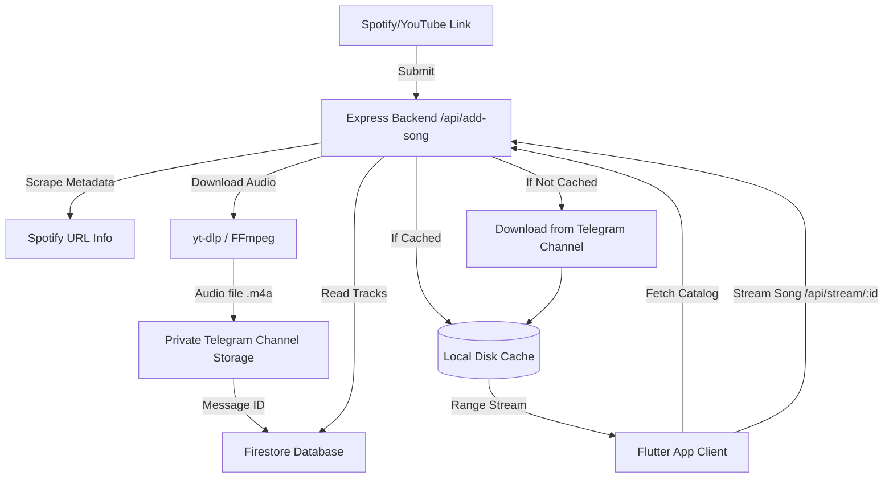

# 🎵 Mixtape & Sonic Vault

> [!IMPORTANT]
> **For Personal Use Only.** This project is developed strictly for personal use as a private, self-hosted media streaming vault.

**Mixtape** (the Android APK client) and **Sonic Vault** (the Web App and Backend service) form a self-hosted, cloud-native music streaming platform. It allows you to scrape, download, and catalog high-quality music from YouTube and Spotify links, upload it securely to a private Telegram channel (which serves as a zero-cost media hosting vault), index the catalog in Google Cloud Firestore, and stream it in real-time.

---

## 🚀 Key Features

### 📡 The Backend (Node.js & Express)
*   **Smart Music Downloader**: Integrates `yt-dlp` and `ffmpeg` to download high-fidelity audio tracks from YouTube URLs or by searching dynamically.
*   **Spotify Metadata Resolver**: Scrapes details (album cover, artist, tracks, duration) from Spotify links using `spotify-url-info`.
*   **Zero-Cost Media Vault**: Stores raw audio files (`.m4a`) as media messages in a private Telegram channel via the MTProto client (`telegram` package).
*   **Firestore Metadata Sync**: Stores catalog details, playlist configurations, and Telegram message IDs in Google Cloud Firestore.
*   **Real-time Streaming Engine**: Implements HTTP Range requests (`Accept-Ranges: bytes`) for smooth audio streaming, seeking, and caching.
*   **Local Precaching**: Caches frequently played tracks in a temporary directory (`/tmp/music-cache`) to minimize Telegram API rate limits.
*   **PWA/TWA Trusted Web Handshake**: Fully serves Android Trusted Web Activity (TWA) asset link handshakes (`/.well-known/assetlinks.json`).

### 📱 The Frontend (Flutter Client)
*   **Premium Visual Experience**: Built on the **Sonic Immersion** design system, featuring a deep dark aesthetic (`#121414`), glassmorphic panels, dynamic Montserrat/Hanken Grotesk typography, and "Sonic Green" (`#1DB954`) accents.
*   **Now Playing Screen**: Features a gorgeous glassmorphic canvas using a blurred image of the active album art, with custom micro-animations.
*   **Background Playback**: Integrates `just_audio` and `audio_service` to provide seamless background streaming, seeking, lock-screen controls, and system notification integration.
*   **Playlists & Library**: Full support for creating, adding, and removing songs from custom user playlists, along with sorting by artist, album, and date added.
*   **Configurable Host**: Seamlessly switches endpoints to connect to local development environments or remote servers.

---

## 📐 Architecture Overview



---

## 📂 Repository Structure

```text
├── android/                   # Generated Android configuration & TWA manifests
├── backend/                   # Node.js + Express API & media processing scripts
│   ├── adder.js               # Logic for parsing YouTube/Spotify links and adding songs
│   ├── downloader.js          # Core yt-dlp downloader wrapper
│   ├── telegram.js            # MTProto client wrapper for Telegram uploads/deletions
│   ├── firebase.js            # Firestore & Admin SDK database connection setup
│   ├── server.js              # Express API Server hosting stream, queue, and playlist endpoints
│   ├── manual_add.js          # Command-line utility for manual music importing
│   └── package.json           # Backend package configuration
├── docs/                      # Architectural plans and deployment logs
├── flutter_app/               # Flutter native app source code
│   ├── lib/
│   │   ├── main.dart          # Flutter App bootstrap and theme setup
│   │   ├── audio_handler.dart # AudioService wrapper for background audio logic
│   │   ├── screens/           # UI screen layouts (Main, Album Detail, Queue, Settings)
│   │   ├── services/          # API & Storage connection services
│   │   └── widgets/           # Custom reusable widgets (Mini-Player, Cards, Buttons)
│   └── pubspec.yaml           # Flutter pub dependencies
├── Dockerfile                 # Multi-stage production container setup
├── render.yaml                # Render Infrastructure-as-code template
└── deploy.sh                  # Deploy script for Google Cloud Run
```

---

## 🛠️ Getting Started: Backend

### 📋 Prerequisites
Ensure you have the following installed on your server or local machine:
*   [Node.js](https://nodejs.org/) (v18 or higher)
*   [FFmpeg](https://ffmpeg.org/) (Required for audio format extraction)
*   [Python](https://www.python.org/) & `yt-dlp` (Must be globally accessible or in the system path)

### ⚙️ Environment Configuration
Create a `.env` file in the `backend/` directory:

```env
PORT=8080
FFMPEG_LOCATION=              # Optional: absolute path to FFmpeg binary if not in PATH
TELEGRAM_API_ID=your_api_id   # Get from https://my.telegram.org
TELEGRAM_API_HASH=your_hash
TELEGRAM_BOT_TOKEN=your_token # Get from @BotFather
TELEGRAM_CHANNEL_ID=-100...   # Private Telegram Channel ID where music is uploaded
TELEGRAM_SESSION=             # String session generated using MTProto client
```

For Firebase integration, download your Service Account JSON file from the Firebase Console and save it to `backend/firebase-key.json`.

### 🚀 Running the Server Locally
1. Navigate to the backend directory and install dependencies:
   ```bash
   cd backend
   npm install
   ```
2. Start the development server:
   ```bash
   node server.js
   ```
3. Use the CLI tool to manually import tracks:
   ```bash
   node manual_add.js
   ```

### 🚢 Deployment

The backend application is currently deployed on **Render** (Free Tier). To prevent the Free tier container from automatically sleeping after 15 minutes of inactivity, an external keep-alive pinging monitor is configured. Alternatively, deploying to **Google Cloud Run** is also fully supported.

#### Option A: Render Free Tier (Current Setup)
1. Render deploys directly from your connected GitHub repository and builds automatically on every `git push` using the root [Dockerfile](file:///d:/music/Dockerfile).
2. Configure the required environment variables in the Render Web Service dashboard (see [render_migration.md](file:///d:/music/render_migration.md) for details).
3. **Keep-Alive (No Sleep) configuration**: Register a free monitor with [UptimeRobot](https://uptimerobot.com/) or [cron-job.org](https://cron-job.org/) to ping the server URL (`https://your-service.onrender.com/`) every 10–12 minutes. This keeps the container continuously active and prevents the 30–50 second cold start delay.
4. For a full step-by-step walkthrough, see the [Render Migration Guide](file:///d:/music/render_migration.md).

#### Option B: Google Cloud Run (Alternative Setup)
The codebase is containerized and includes an automated deploy script. To deploy to Cloud Run:
```bash
./deploy.sh
```

---

## 🛠️ Getting Started: Flutter App

### 📋 Prerequisites
*   [Flutter SDK](https://docs.flutter.dev/get-started/install) (v3.0.0 or higher)
*   An Android or iOS emulator / physical device

### 🚀 Setup & Launch
1. Open the app directory:
   ```bash
   cd flutter_app
   ```
2. Get dependencies:
   ```bash
   flutter pub get
   ```
3. Configure the backend API host. In [api_service.dart](file:///d:/music/flutter_app/lib/services/api_service.dart), update the `baseUrl` string to point to your hosted backend:
   ```dart
   static String baseUrl = 'https://your-backend-url.onrender.com';
   ```
4. Run the app:
   ```bash
   flutter run
   ```

---

## 🔒 Security Note
Do not commit confidential files like `backend/.env` or `backend/firebase-key.json` to public repositories. When deploying to Render or Cloud Run, parse service account credentials dynamically by copying the JSON content into the `FIREBASE_KEY_JSON` environment variable (the backend configuration dynamically reads this if `firebase-key.json` is missing).

---

## 📄 License
This project is released under the **ISC License**.
