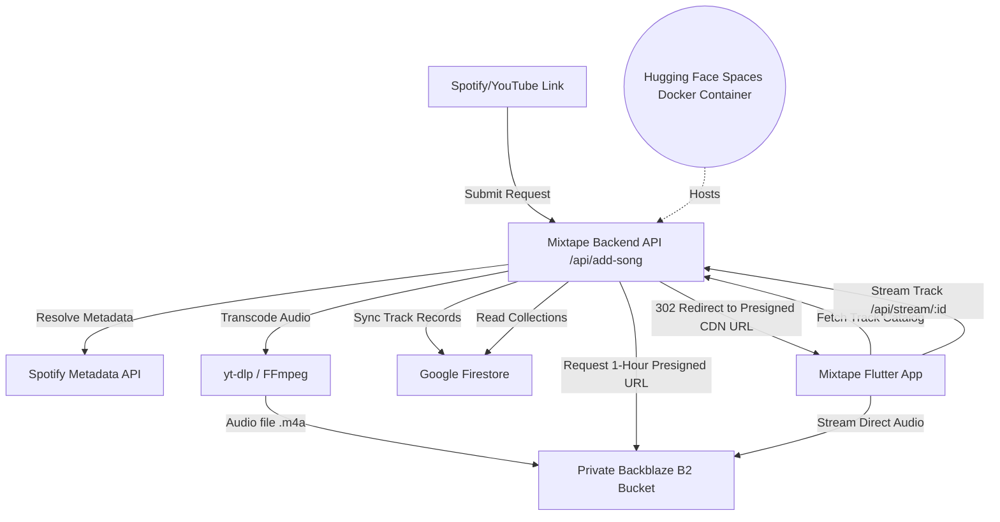

# 🎵 Mixtape

> [!IMPORTANT]
> **For Personal Use Only.** This project is designed and developed strictly for personal use as a private, self-hosted media streaming vault.

**Mixtape** (the Flutter mobile client) and **Mixtape Backend** (the Node.js/Express backend) form a self-hosted, cloud-native music streaming infrastructure. It allows you to scrape, transcode, and catalog high-quality music from YouTube and Spotify links, store it securely in your own private Backblaze B2 storage bucket, catalog the metadata in Google Cloud Firestore, and stream it on your mobile device in real-time.

> **Looking for the setup guide?** Please check [setup.md](./setup.md) for full instructions on cloning, configuring, and deploying the app and backend.

---

## 🚀 Key Features

### 📡 The Mixtape Backend
* **Smart Music Downloader**: Integrates `yt-dlp` and `ffmpeg` to download high-fidelity audio tracks from YouTube URLs or by searching dynamically.
* **Spotify Metadata Resolver**: Resolves metadata (album art, artist names, titles, duration) from Spotify links.
* **Private B2 Cloud Storage**: Uploads transcoded `.m4a` files directly to a private Backblaze B2 bucket (via the AWS S3 SDK), ensuring persistent and secure storage.
* **Firestore Catalog Sync**: Syncs track catalogs, playlists, and listening room states in Google Cloud Firestore.
* **Secure Redirect Streaming**: Generates short-lived, pre-signed download URLs (1-hour expiration) for audio tracks, redirecting clients securely for direct playback.
* **Listening Room Sync Engine**: Real-time playback synchronization using Socket.io for shared listening rooms.

### 📱 The Mobile Client (Mixtape)
* **Premium Visual Design**: Built using a tailored dark theme (`#121414`), glassmorphic panels, custom Montserrat/Hanken Grotesk typography, and Spotify-style accents.
* **Seamless Background Playback**: Integrates `just_audio` and `audio_service` to provide background audio streaming, seek bars, lock-screen controls, and system media notifications.
* **Playlists & Library**: Full support for creating playlists, liking songs, and sorting catalogs.
* **Dynamic Connection**: Easily configure the API endpoint to point to a local development environment or your hosted production server.

---

## 📐 Architecture Overview



---

## 📂 Repository Structure

```text
├── backend/                   # Node.js + Express API & media processing scripts
│   ├── adder.js               # Resolves Spotify links, spawns yt-dlp, and coordinates uploads
│   ├── downloader.js          # Core yt-dlp downloader wrapper
│   ├── s3.js                  # Backblaze B2 client configuration & presigned URL utility
│   ├── firebase.js            # Firestore database connector
│   ├── sync_engine.js         # Socket.io sync logic for listening rooms
│   ├── server.js              # Express API Server hosting stream, queue, and playlist endpoints
│   ├── .env.example           # Canonical environment configuration template
│   └── package.json           # Backend dependencies and startup scripts
├── docs/                      # Architectural plans and deployment logs
├── flutter_app/               # Flutter native app source code
│   ├── assets/                # Images and brand logo assets
│   ├── lib/
│   │   ├── main.dart          # Flutter App bootstrap and theme setup
│   │   ├── core/              # Global theme and styling constants
│   │   ├── features/          # Feature-first modules (home, library, player, search)
│   │   ├── providers/         # State management using Provider (AudioProvider)
│   │   ├── services/          # API client & local caching
│   │   └── widgets/           # Global custom reusable widgets (MiniPlayer)
│   └── pubspec.yaml           # Flutter pub dependencies & launcher configurations
├── Dockerfile                 # Multi-stage production container setup
└── setup.md                   # Comprehensive Setup Guide
```
