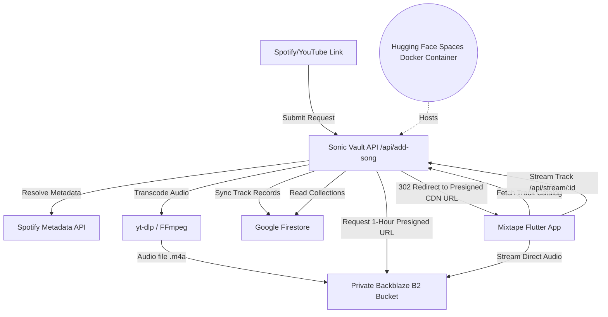

# 🎵 Mixtape & Sonic Vault

> [!IMPORTANT]
> **For Personal Use Only.** This project is designed and developed strictly for personal use as a private, self-hosted media streaming vault.

**Mixtape** (the Flutter mobile client) and **Sonic Vault** (the Node.js/Express backend) form a self-hosted, cloud-native music streaming infrastructure. It allows you to scrape, transcode, and catalog high-quality music from YouTube and Spotify links, store it securely in your own private Backblaze B2 storage bucket, catalog the metadata in Google Cloud Firestore, and stream it on your mobile device in real-time.

---

## 🚀 Key Features

### 📡 The Backend (Sonic Vault)
* **Smart Music Downloader**: Integrates `yt-dlp` and `ffmpeg` to download high-fidelity audio tracks from YouTube URLs or by searching dynamically.
* **Spotify Metadata Resolver**: Resolves metadata (album art, artist names, titles, duration) from Spotify links.
* **Private B2 Cloud Storage**: Uploads transcoded `.m4a` files directly to a private Backblaze B2 bucket (via the AWS S3 SDK), ensuring persistent and secure storage.
* **Firestore Catalog Sync**: Syncs track catalogs, playlists, and listening room states in Google Cloud Firestore.
* **Secure Redirect Streaming**: Generates short-lived, pre-signed download URLs (1-hour expiration) for audio tracks, redirecting clients securely for direct playback.

### 📱 The Mobile Client (Mixtape)
* **Premium Visual Design**: Built using a tailored dark theme (`#121414`), glassmorphic panels, custom Montserrat/Hanken Grotesk typography, and Spotify-style accents.
* **Seamless Background Playback**: Integrates `just_audio` and `audio_service` to provide background audio streaming, seek bars, lock-screen controls, and system media notifications.
* **Playlists & Library**: Full support for creating playlists, liking songs, and sorting catalogs.
* **Dynamic Connection**: Easily configure the API endpoint to point to a local development environment or your hosted production server.

---

## 📐 Architecture Overview



---

## 📂 Repository Structure

```text
├── backend/                   # Node.js + Express API & media processing scripts
│   ├── adder.js               # Resolves Spotify links, spawns yt-dlp, and coordinates uploads
│   ├── downloader.js          # Core yt-dlp downloader wrapper
│   ├── s3.js                  # Backblaze B2 client configuration & presigned URL utility
│   ├── firebase.js            # Firestore database connector
│   ├── server.js              # Express API Server hosting stream, queue, and playlist endpoints
│   ├── manual_add.js          # CLI utility for importing music manually
│   ├── .env.example           # Canonical environment configuration template
│   └── package.json           # Backend dependencies and startup scripts
├── docs/                      # Architectural plans and deployment logs
├── flutter_app/               # Flutter native app source code
│   ├── assets/                # Images and brand logo assets
│   ├── lib/
│   │   ├── main.dart          # Flutter App bootstrap and theme setup
│   │   ├── core/              # Global theme and styling constants
│   │   ├── features/          # Feature-first modules (home, library, player, search)
│   │   ├── providers/         # State management using Provider (AudioProvider)
│   │   ├── services/          # API client & local caching
│   │   └── widgets/           # Global custom reusable widgets (MiniPlayer)
│   └── pubspec.yaml           # Flutter pub dependencies & launcher configurations
├── Dockerfile                 # Multi-stage production container setup
├── render.yaml                # Render Infrastructure-as-code template
└── deploy.sh                  # Deploy script for Google Cloud Run
```

---

## 🛠️ Getting Started: Backend Setup

### 📋 Prerequisites
Ensure you have the following installed on your machine or server:
* **Node.js** (v18 or higher)
* **FFmpeg** (Required for audio format extraction; must be in your system `PATH` or path provided via `.env`)
* **Python 3** & **yt-dlp** (Must be accessible in your system `PATH`)

### 🔑 1. Backblaze B2 Setup
1. Log in to your [Backblaze Account](https://www.backblaze.com/).
2. Create a **Private Bucket** named `MixtapeCloud` (or your preferred name).
3. Go to **App Keys** and generate a new Application Key.
4. Note down the following values:
   * **Endpoint URL** (e.g., `s3.us-east-005.backblazeb2.com` — *omit `https://` in env*)
   * **Key ID**
   * **Application Key**
   * **Bucket Name**
   * **Region** (e.g., `us-east-005`)

### 🔥 2. Firebase & Firestore Setup
1. Create a project in the [Firebase Console](https://console.firebase.google.com/).
2. Initialize **Firestore Database** in production mode or test mode.
3. Set up a service account: Go to **Project Settings** → **Service Accounts** → Click **Generate new private key**.
4. Download the generated `.json` file, rename it to `firebase-key.json`, and place it in the `backend/` directory.

### 🎵 3. Spotify API Setup
1. Go to the [Spotify Developer Dashboard](https://developer.spotify.com/dashboard).
2. Create a new application to obtain your client credentials:
   * **Client ID**
   * **Client Secret**

### ⚙️ 4. Environment Variables
Create a file named `.env` in the `backend/` directory using `backend/.env.example` as a template:

```env
PORT=8080
SPOTIFY_CLIENT_ID=your_spotify_client_id
SPOTIFY_CLIENT_SECRET=your_spotify_client_secret

# Backblaze B2 Configuration (S3 API compatible)
B2_ENDPOINT=s3.us-east-005.backblazeb2.com
B2_KEY_ID=your_b2_key_id
B2_APPLICATION_KEY=your_b2_application_key
B2_BUCKET_NAME=your_bucket_name
B2_REGION=us-east-005

# Optional: Path to FFmpeg binary if it is not in your global system PATH
# FFMPEG_LOCATION="C:\path\to\ffmpeg.exe"
```

### 🚀 Running the Server Locally
1. Navigate to the backend directory and install dependencies:
   ```bash
   cd backend
   npm install
   ```
2. Start the server:
   ```bash
   node server.js
   ```
3. (Optional) Run the CLI script to manually download and add songs:
   ```bash
   node manual_add.js
   ```

---

## 🛠️ Getting Started: Flutter App Setup

### 📋 Prerequisites
* **Flutter SDK** (v3.0.0 or higher)
* An Android/iOS emulator or physical test device

### 🚀 Launching the App
1. Navigate to the App directory:
   ```bash
   cd flutter_app
   ```
2. Install dependencies:
   ```bash
   flutter pub get
   ```
3. Open [api_service.dart](file:///d:/music/flutter_app/lib/services/api_service.dart) and configure the `baseUrl` variable to point to your hosted backend API:
   ```dart
   static String baseUrl = 'https://shanin-05-mixtape.hf.space';
   ```
4. Build and run:
   ```bash
   flutter run
   ```

---

## 🚢 Deployment

### Option A: Hugging Face Spaces (Docker Container)
Sonic Vault uses a `Dockerfile` for easy deployment on Hugging Face Spaces:
1. Create a new Space on [Hugging Face](https://huggingface.co/spaces) and select **Docker** as the SDK.
2. Push your repository to the space.
3. **Environment Configuration**: Go to the Space **Settings** -> **Variables and secrets**. 
   - Add all standard variables (`B2_ENDPOINT`, `B2_KEY_ID`, `B2_APPLICATION_KEY`, `B2_BUCKET_NAME`, `SPOTIFY_CLIENT_ID`, `SPOTIFY_CLIENT_SECRET`) as **Secrets**.
   - Copy the entire raw JSON text of `firebase-key.json` and paste it as the value for the `FIREBASE_KEY_JSON` secret.
4. **Benefits**: 
   - Generous free-tier bandwidth (effectively resolving the 5GB limitations seen on other PaaS like Zeabur/Supabase).
   - Solid container specs (e.g., 2 vCPU, 16GB RAM for the free tier).
   - Fast spin-up times for Docker containers, avoiding long cold-starts typical of free tiers.

### Option B: Google Cloud Run
A custom deployment script is included at the root of the project:
1. Ensure the Google Cloud CLI (`gcloud`) is installed and authenticated.
2. Execute the deployment script:
   ```bash
   ./deploy.sh
   ```

---

## 🔒 Security Considerations (Homelab Threat Model)

This application is designed specifically as a single-tenant personal vault. To avoid over-engineering, several enterprise-level security features are omitted by design, but can be configured if needed:

* **No API Authentication Middleware**: Since this is a private server accessed only by your device, standard API token management is bypassed to simplify deployment. If you expose your instance publically, it is highly recommended to run it behind a reverse proxy (e.g., Caddy, Nginx) configured with Basic Authentication or Cloudflare Access.
* **Wildcard CORS**: CORS is open (`*`) by default to make integration with multi-platform mobile clients simple.
* **Subprocess Security**: The backend includes robust command-sanitization mechanisms (`--` separators) to prevent malicious YouTube/Spotify query inputs from causing remote code execution on the host machine.
* **Service Account Security**: Ensure that the `firebase-key.json` and `.env` files are never committed to git history.
