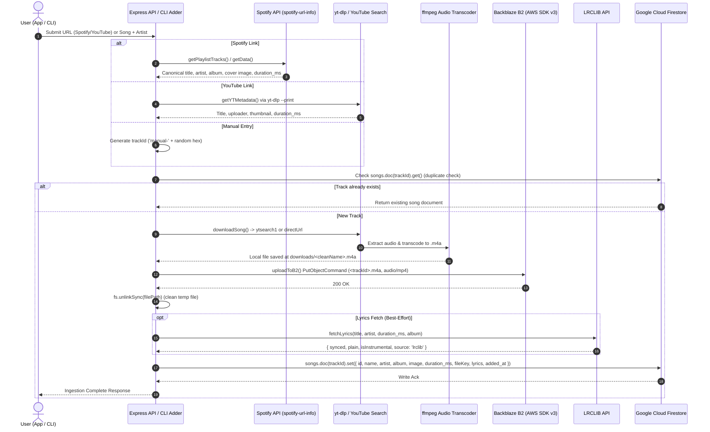
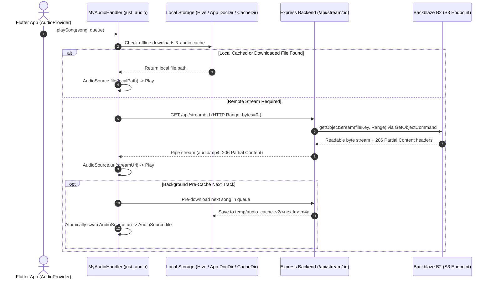
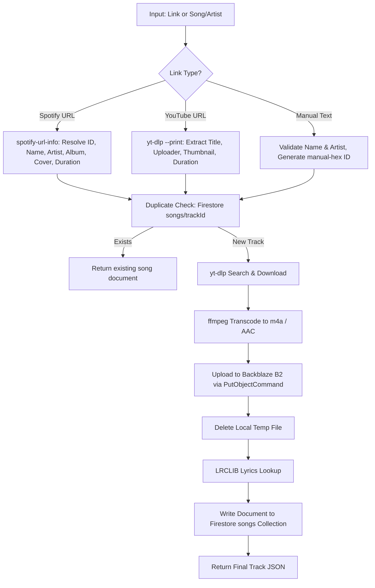
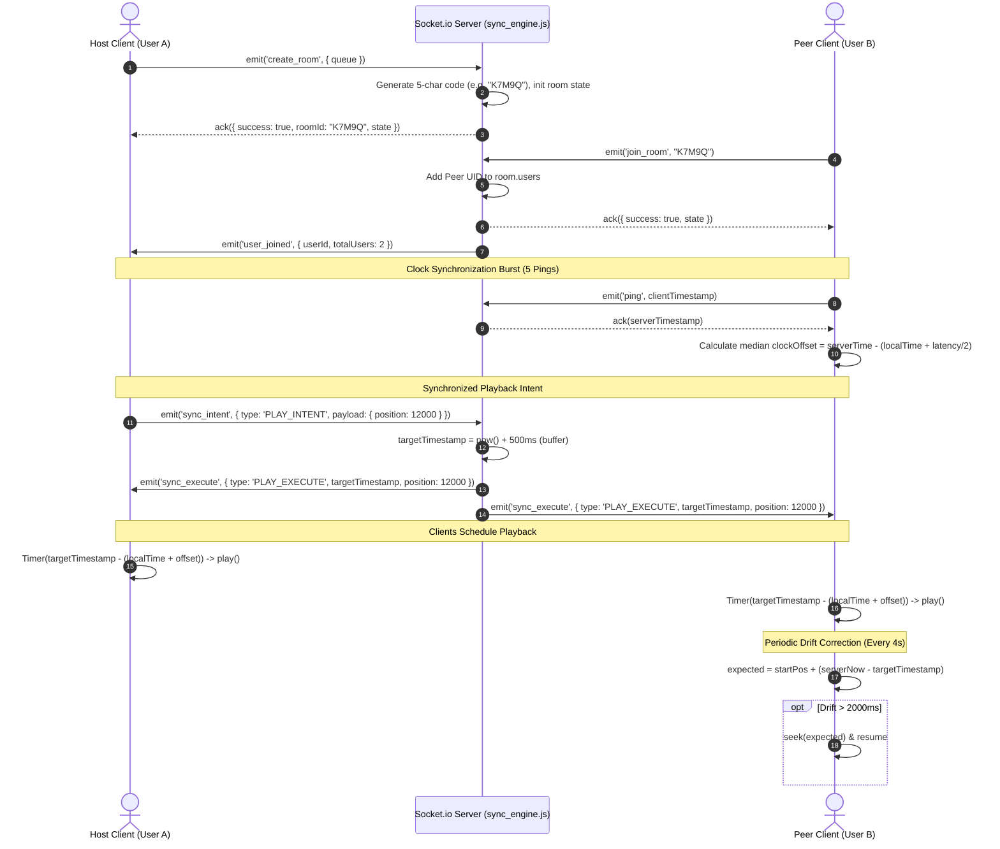

# Mixtape — System Design & Architecture Document

## 1. Overview

**Mixtape** is a self-hosted, personal cloud music streaming and real-time synchronized listening platform. It consists of a cross-platform Flutter mobile client and a Node.js/Express companion backend integrated with Backblaze B2 object storage and Google Cloud Firestore. The backend automates song ingestion by scraping audio and metadata from Spotify or YouTube, transcoding streams to `.m4a` via `ffmpeg`, persisting media to private B2 vaults, and querying synchronized LRC lyrics from LRCLIB with optional AI-powered transliteration via Google Gemini. Multi-user "Listening Rooms" enable sub-second synchronized group listening over Socket.io with clock drift compensation. The system is designed strictly for personal, self-hosted usage.

```
┌────────────────────────────────────────────────────────┐
│                     Flutter Client                     │
│   (just_audio + audio_service + Hive + Socket.io-client)│
└───────────────────────────┬────────────────────────────┘
                            │ REST / WebSockets
                            ▼
┌────────────────────────────────────────────────────────┐
│                   Express API Server                   │
│         (Node.js 22, Socket.io Sync Engine)            │
└──────────────┬────────────────────────────┬────────────┘
               │                            │
               ▼                            ▼
┌──────────────────────────────┐  ┌──────────────────────┐
│     Backblaze B2 Storage     │  │   Cloud Firestore    │
│  (Private S3 Audio Objects)  │  │  (Catalog & Playlists)│
└──────────────────────────────┘  └──────────────────────┘
```

---

## 2. Architecture Diagram

### Ingestion Pipeline Data Flow



### Streaming & Playback Data Flow



---

## 3. Data Model

All primary catalog and playlist data is persisted in Google Cloud Firestore. The schemas below reflect actual reads and writes across [`backend/adder.js`](file:///d:/music/backend/adder.js), [`backend/server.js`](file:///d:/music/backend/server.js), [`backend/relink_songs.js`](file:///d:/music/backend/relink_songs.js), and [`backend/transliterate_lyrics.js`](file:///d:/music/backend/transliterate_lyrics.js).

### Firestore Collections

#### 1. `songs` Collection
*Document ID*: Spotify Track ID (e.g. `4cOdK2wGLETKBW3PvgPWqT`), `sp-${timestamp}`, or `manual-${hex}`.

| Field Name | Type | Description / Notes |
| :--- | :--- | :--- |
| `id` | `string` | Unique track identifier (canonical Spotify ID or `manual-[12hex]`). |
| `name` | `string` | Track title. |
| `artist` | `string` | Primary artist or comma-separated artist string. |
| `album` | `string` | Album name (defaults to `'Synced Addition'` on non-Spotify ingestion). |
| `image` | `string \| null` | Cover artwork URL. If `null`/empty, backend dynamically maps to a seeded random local cover image (`/images/*.jpg`). |
| `duration_ms` | `number` | Track duration in milliseconds (0 if unknown at creation). |
| `fileKey` | `string` | S3/B2 object key in the storage bucket (e.g. `${track.id}.m4a`). |
| `added_at` | `Timestamp` | Firestore server timestamp (`FieldValue.serverTimestamp()`). |
| `lyrics` | `object \| null` | *(Optional)* Embedded lyrics payload (see nested schema below). |
| `lyricsOriginal` | `object \| null` | *(Optional)* Backup of original non-Latin lyrics before transliteration was applied. |
| `relinked_at` | `string` | *(Optional, ISO 8601)* Set only when processed by `relink_songs.js`. |
| `relinked_from` | `object` | *(Optional)* Metadata of the selected YouTube candidate from relinking. |
| `relinked_from.yt_title` | `string` | YouTube video title of the relinked source. |
| `relinked_from.yt_channel` | `string` | YouTube uploader/channel name. |
| `relinked_from.yt_duration` | `number` | Video duration in seconds. |
| `relinked_from.yt_url` | `string` | Full YouTube URL (`https://www.youtube.com/watch?v=...`). |

##### Nested `lyrics` Object Schema:
```json
{
  "synced": "[00:12.34] Timestamped LRC text\n[00:15.67] Second line...",
  "plain": "Unsynced plain text lyrics...",
  "isInstrumental": false,
  "source": "lrclib",
  "updated_at": "2026-08-15T18:04:22.000Z",
  "transliterated": true,
  "transliterated_at": "2026-08-15T18:05:00.000Z"
}
```

#### 2. `playlists` Collection
*Document ID*: `pl-${timestamp}` or `pl-${timestamp}-${random}`.

| Field Name | Type | Description / Notes |
| :--- | :--- | :--- |
| `id` | `string` | Playlist identifier. |
| `name` | `string` | Playlist title (e.g., custom user title or auto-generated category like `'Hindi'`, `'Malayalam'`, `'Pop'`). |
| `songs` | `string[]` | Ordered array of song document IDs (`songs[i]`). |
| `image` | `string` | Relative path (`/images/...`) or full URL for playlist cover art. |
| `created_at` | `string` | ISO 8601 creation timestamp. |

---

### In-Memory State Models

#### `activeRooms` Map (`backend/sync_engine.js`)
*Key*: `roomId` (5-character uppercase alphanumeric string, excluding ambiguous characters: `ABCDEFGHJKLMNPQRSTUVWXYZ23456789`).

```typescript
interface ActiveRoom {
  roomId: string;
  hostId: string;                     // Firebase Auth UID of room creator
  users: Set<string>;                 // Set of active Firebase Auth UIDs
  queue: Array<SongMetadata>;         // Ordered queue of tracks
  currentIndex: number;               // Current playing index in queue
  currentSongId: string | null;       // Active song ID
  currentTrackUrl: string | null;     // Stream endpoint for active song
  playbackState: 'PLAYING' | 'PAUSED';// Room sync state
  targetTimestamp: number | null;     // Server epoch ms for future synced start (+500ms/+1000ms)
  position: number;                   // Playback position in milliseconds
  eventLog: Array<SyncEvent>;         // History of sync intents executed
  cleanupTimer: NodeJS.Timeout | null;// 3-minute grace period timer when room is empty
}
```

#### Client-Side Local Storage Models (Hive & SharedPreferences)
- **Hive Box `offline_songs`**: Key is `songId`, value is serialized `OfflineSongMetadata` (`id`, `name`, `artist`, `album`, `image`, `duration_ms`, `file_path`, `file_size`, `downloaded_at`).
- **Hive Box `song_lyrics`**: Key is `songId`, value is serialized `LyricsData` (`synced`, `plain`, `isInstrumental`, `source`).
- **SharedPreferences**: Keys `sv_liked` (list of liked song IDs), `sv_recent_searches` (list of recent search IDs), `sv_songs_cache` (cached JSON array of library songs).

---

## 4. Song Ingestion Pipeline

The song ingestion pipeline transforms arbitrary links or raw title/artist text into playable, cloud-vaulted tracks with synchronized lyrics.



### 1. Metadata Resolution
- **Spotify Links** ([`backend/spotify.js`](file:///d:/music/backend/spotify.js)): Uses `spotify-url-info` to scrape track details directly without requiring Spotify user OAuth tokens for ingestion. Extracts high-resolution artwork from `visualIdentity`, `coverArt`, or `album.images`.
- **YouTube Links** ([`backend/adder.js`](file:///d:/music/backend/adder.js)): Spawns `yt-dlp --print "%(title)s|%(uploader)s|%(thumbnail)s|%(duration)s"`.
- **Manual Metadata** ([`backend/manual_add.js`](file:///d:/music/backend/manual_add.js)): Generates a random 6-byte hex ID prefixed with `manual-` (e.g. `manual-8f3a9b1c2d4e`).

### 2. Audio Download & Transcoding Parameters
Implemented in [`backend/downloader.js`](file:///d:/music/backend/downloader.js):
- Sanitizes title and artist strings to strip quotation marks and illegal filesystem characters (`[/\\?%*:|"<>]` replaced with `-`).
- Command: `yt-dlp` (with automatic fallback to `python -m yt_dlp` on environments where `yt-dlp` is not directly on `PATH`).
- Key execution flags:
  - `--extract-audio`: Extracts audio stream.
  - `--audio-format m4a`: Transcodes stream to AAC `.m4a` using `ffmpeg`.
  - `--no-playlist`: Restricts download to single item.
  - `--js-runtimes node`: Uses Node.js to evaluate YouTube challenge scripts.
  - `--extractor-args youtube:player_client=ios,android,web`: Emulates mobile and web clients to bypass bot blocks and throttles.
  - `--no-check-certificates`: Bypasses SSL handshake discrepancies on restricted host environments.
  - Target output: `backend/downloads/<CleanTitle>.m4a`.

### 3. Backblaze B2 Storage Integration
Implemented in [`backend/s3.js`](file:///d:/music/backend/s3.js):
- Uses `@aws-sdk/client-s3` (`S3Client`) pointed at Backblaze B2 S3-compatible endpoints (e.g., `s3.us-east-005.backblazeb2.com`).
- **Critical Backblaze Compatibility Flag**:
  ```javascript
  requestChecksumCalculation: 'WHEN_REQUIRED',
  responseChecksumValidation: 'WHEN_REQUIRED'
  ```
  *(Backblaze B2 does not support default AWS S3 checksum algorithms; without these flags, AWS SDK v3 appends `x-amz-checksum-mode=ENABLED` which triggers HTTP 403 Forbidden on B2).*
- Uploads buffer via `PutObjectCommand` with `ContentType: 'audio/mp4'` at key `${trackId}.m4a`.
- Cleans up the local temporary `.m4a` file immediately via `fs.unlinkSync()`.

### 4. Advanced Candidate Ranking & Channel Trust Tiering (`backend/relink_songs.js`)
When relinking existing library tracks to fix bad audio cuts or align lyrics with canonical Spotify durations:

1. **Candidate Retrieval**: Fetches top 5 candidates via `ytsearch5:${artist} ${title}` using `--dump-json --flat-playlist --no-download`.
2. **Version Keyword Rejection**: Rejects any candidate containing version-altering keywords (`sped up`, `slowed`, `slowed + reverb`, `nightcore`, `8d audio`, `extended`, `remix`, `cover`, `live`, `karaoke`, `instrumental`, `reaction`) using word-boundary regexes, **unless** the canonical Spotify title itself contains that keyword.
3. **Duration Closeness Filter**: Discards candidates with `|candidateDuration - spotifyDuration| > 2` seconds.
4. **Scoring Formula**:
   $$\text{Score} = (2 - |\Delta t|) \times 100 + \text{ChannelBonus}$$
   - Channel Bonus: `+10` for `- Topic` channels; `+8` if channel name equals artist name.
5. **Channel Trust Tiering**:
   - **Tier 1 (`topic`)**: YouTube auto-generated `"Artist - Topic"` channels (highest confidence, studio master).
   - **Tier 2 (`verified-label`)**: Known labels (`vevo`, `records`, `universal`, `sony`, `warner`, `t-series`, `saregama`, etc.) or exact artist matches.
   - **Tier 3 (`unverified`)**: Fan uploads and unofficial channels.
6. **Dry-Run Batching**: When run without `--commit`, exports candidate IDs into `trusted_batch.txt` (Tier 1 & 2) and `review_batch.txt` (Tier 3) to allow manual review before applying audio overwrites.

---

## 5. Lyrics Pipeline

Lyrics are fetched from the public **LRCLIB** database, cached in Firestore and client-side Hive boxes, and optionally transliterated using the Google Gemini API.

```
                  ┌───────────────────────────────┐
                  │    Track Metadata + Duration  │
                  └──────────────┬────────────────┘
                                 │
                                 ▼
                  ┌───────────────────────────────┐
                  │     Title & Artist Cleaner    │
                  │   (Strip movie/feat/video tags)│
                  └──────────────┬────────────────┘
                                 │
                                 ▼
                  ┌───────────────────────────────┐
                  │    LRCLIB 5-Tier Fallback     │
                  │ (Exact get -> Clean -> Raw Srch)│
                  └──────────────┬────────────────┘
                                 │
                   ┌─────────────┴─────────────┐
                   ▼                           ▼
          [Synced Lyrics (LRC)]       [Plain Lyrics / None]
                   │                           │
                   └─────────────┬─────────────┘
                                 │
                                 ▼
                  ┌───────────────────────────────┐
                  │   Transliteration Pipeline?   │
                  │      (Non-Latin Script)       │
                  └──────────────┬────────────────┘
                                 │
                     ┌───────────┴───────────┐
                     │ Non-Latin             │ Latin Only
                     ▼                       ▼
      ┌─────────────────────────────┐   ┌──────────────┐
      │ Separate Content / Blanks   │   │ Keep As-Is   │
      │ Numbered Gemini 3.5 Prompt  │   └──────┬───────┘
      │ Strict Line Count Check     │          │
      │ Backup to lyricsOriginal    │          │
      │ Overwrite lyrics in DB      │          │
      └──────────────┬──────────────┘          │
                     │                         │
                     └───────────┬─────────────┘
                                 │
                                 ▼
                    ┌─────────────────────────┐
                    │ Firestore + Hive Cached │
                    └─────────────────────────┘
```

### 1. LRCLIB Matching Strategy ([`backend/lyrics.js`](file:///d:/music/backend/lyrics.js))
- **Title Cleaning (`cleanSongTitle`)**: Strips metadata noise:
  - Regexes remove: `(From ...)`, `(feat. ...)`, `[Official Video]`, `(Lyrical)`, `(Audio)`, `(Original)`, `(Remix)`, `(Reprise)`, `(Female/Male/Duet)`, quotes, dashes, and extra whitespace.
- **Artist Cleaning (`cleanArtistName`)**: Strips secondary artists after commas, `&`, or `feat.`.
- **5-Tier Fallback Hierarchy**:
  1. Exact GET (`/api/get`): `cleanTitle` + `cleanArtist` + `duration` + `album`.
  2. Exact GET (`/api/get`): `rawTitle` + `rawArtist` + `duration`.
  3. Search (`/api/search`): `q=${cleanTitle} ${cleanArtist}` with best-match scoring.
  4. Search (`/api/search`): `q=${cleanTitle}` only (handles multi-artist mismatches).
  5. Search (`/api/search`): `q=${rawTitle}`.
- **Best Match Selection (`pickBestMatch`)**:
  - Tier A: $|\Delta \text{duration}| \le 4\text{s}$ AND contains `syncedLyrics`.
  - Tier B: $|\Delta \text{duration}| \le 6\text{s}$ AND contains `syncedLyrics` or `plainLyrics`.
  - Tier C: First result with `syncedLyrics`.
  - Tier D: First result with `plainLyrics` or `isInstrumental`.

### 2. Gemini Transliteration Pipeline ([`backend/transliterate_lyrics.js`](file:///d:/music/backend/transliterate_lyrics.js))
Translates Indic/non-Latin scripts (Hindi, Malayalam, Tamil, etc.) into casual English phonetic script (YouTube lyric video style), strictly avoiding academic IAST diacritical marks.

- **Latin Check**: Regex `/^[\u0000-\u024F]*$/` skips songs already written in Latin script.
- **Blank Line Preservation**: Separates content lines from blank lines and tracks their original indices. Blank lines are never sent to Gemini to prevent LLM hallucinations or line merges.
- **Numbered Prompt Strategy**: Sends numbered lines (`1. line\n2. line`) to `gemini-3.5-flash-lite` with `temperature: 0.1` and a system prompt forbidding translation, diacritics, or line merging.
- **Line Count Verification**:
  - Compares returned line count directly against input content line count.
  - If counts mismatch, the script aborts update for that song to prevent corrupted LRC timestamp mappings.
  - Reassembles blank lines at original indices and verifies that the total reassembled line count equals the original LRC line count.
- **Safe Schema Migration**:
  - Moves existing original script lyrics to `song.lyricsOriginal`.
  - Writes transliterated lyrics to `song.lyrics` with `transliterated: true` and `transliterated_at` timestamp.
- **Checkpointing**: Checkpoint entries (`transliterate_checkpoint.json`) are committed to disk **only after** Firestore write success.

---

## 6. Streaming & Playback

### 1. Server-Side Audio Streaming ([`backend/server.js`](file:///d:/music/backend/server.js))
Audio streaming is served through `GET /api/stream/:id`:
- Song metadata is retrieved from the in-memory cache or Firestore.
- Backend resolves `fileKey` (e.g. `${song.id}.m4a`).
- Calls `getObjectStream(key, range)` in [`backend/s3.js`](file:///d:/music/backend/s3.js) using `@aws-sdk/client-s3` `GetObjectCommand`.
- Forwards HTTP `Range` headers (e.g. `bytes=1048576-`) to B2 and streams the audio buffer back with HTTP `206 Partial Content`, `Content-Type: audio/mp4`, `Accept-Ranges: bytes`, `Content-Length`, and `Content-Range`.
*(Note: Presigned URLs can be generated via `getPresignedUrl()` in `s3.js`, but the production server proxies streams directly via `getObjectStream` to handle byte-range requests seamlessly across mobile devices).*

### 2. Client-Side Playback Architecture (Flutter)

```
┌────────────────────────────────────────────────────────────────────────┐
│                        AudioProvider (ChangeNotifier)                  │
│   (UI State: isPlaying, activeLyricIndex, likedSongs, sleepTimer)      │
└───────────────────────────────────┬────────────────────────────────────┘
                                    │
                                    ▼
┌────────────────────────────────────────────────────────────────────────┐
│                      MyAudioHandler (BaseAudioHandler)                 │
│         (just_audio AudioPlayer + ConcatenatingAudioSource)            │
└──────────────┬────────────────────────────┬────────────────────────────┘
               │                            │
               ▼                            ▼
┌──────────────────────────────┐  ┌──────────────────────────────────────┐
│     AudioSession Config      │  │        Atomic Synchronization        │
│  (Music category, Ducking,   │  │   _playlistLock: Sequential ops      │
│   Background lockscreen)     │  │   _playRequestVersion: Stale cancels │
└──────────────────────────────┘  └──────────────────────────────────────┘
               │
               ▼
┌────────────────────────────────────────────────────────────────────────┐
│                      Three-Tier Audio Source Resolution                │
│  1. Offline Download (Hive offline_songs -> FileAudioSource)          │
│  2. Local Pre-Cache (audio_cache_v2 -> FileAudioSource)                │
│  3. Remote Stream (/api/stream/:id -> UriAudioSource)                  │
└────────────────────────────────────────────────────────────────────────┘
```

- **Audio Focus & Background Playback** ([`flutter_app/lib/core/audio_handler.dart`](file:///d:/music/flutter_app/lib/core/audio_handler.dart)): `AudioSession` is configured with `AVAudioSessionCategory.playback` and `AndroidAudioContentType.music`, granting background audio permissions and ducking during navigation alerts.
- **Race Condition Prevention**:
  - Uses `_synchronized` mutex lock (`_playlistLock`) for all queue modifications and playlist operations.
  - Implements `_playRequestVersion` incrementing counter to discard stale `updateQueueAndPlay` requests during fast user skipping.
  - `_player.play()` is invoked asynchronously without awaiting to prevent deadlocking the `_playlistLock` mutex during playback.
- **Stall Watchdog**: A background timer runs every 5 seconds. If `_player.playing == true` but `position` remains static across two checks, it initiates a seek-and-resume playback recovery.
- **Pre-Caching Next Song** ([`flutter_app/lib/services/audio_cache_service.dart`](file:///d:/music/flutter_app/lib/services/audio_cache_service.dart)): When index $N$ starts playing, `_checkPreCache(N)` automatically downloads track $N+1$ into the temporary cache directory (`audio_cache_v2/`) and hot-swaps the `UriAudioSource` in the active `_playlist` with an `AudioSource.file()`.
- **Active Lyric Calculation**: `AudioProvider` listens to `positionStream` and computes the active line by finding the largest line timestamp $\le \text{currentPosition}$.

---

## 7. Real-Time Sync (Listening Rooms)

The Listening Room engine enables multi-user synchronized music playback with sub-second latency alignment over WebSockets.



### 1. Clock Synchronization
Clients synchronize their local clocks with the server using a 5-sample ping burst:
$$\text{latency} = \frac{t_1 - t_0}{2}$$
$$\text{offset} = \text{serverTime} - (t_0 + \text{latency})$$
The median offset is stored in `SyncClient._clockOffset`. `SyncClient.getServerTime()` computes `DateTime.now().millisecondsSinceEpoch + _clockOffset`.

### 2. Supported Sync Intents & Event Sourcing
All users in a room have equal control rights. Every action is transmitted as a `sync_intent` and resolved into a `sync_execute` broadcast:

| Intent Type | Server Action & State Change | Broadcast Event | Latency Buffer |
| :--- | :--- | :--- | :--- |
| `PLAY_INTENT` | `playbackState = 'PLAYING'`, `targetTimestamp = now + 500ms` | `PLAY_EXECUTE` | 500 ms |
| `PAUSE_INTENT` | `playbackState = 'PAUSED'`, `targetTimestamp = null` | `PAUSE_EXECUTE` | 0 ms (immediate) |
| `SEEK_INTENT` | Updates `position`; if playing, sets `targetTimestamp = now + 500ms` | `PLAY_EXECUTE` or `SEEK_EXECUTE` | 500 ms / 0 ms |
| `CHANGE_TRACK_INTENT` | Sets `currentSongId`, `position = 0`, `targetTimestamp = now + 1000ms` | `TRACK_CHANGE_EXECUTE` | 1000 ms (track load buffer) |
| `UPDATE_QUEUE_INTENT` | Updates queue order and current track index | `QUEUE_UPDATE_EXECUTE` | Immediate |
| `ADD_TO_QUEUE_INTENT` | Appends song(s) to room queue | `QUEUE_UPDATE_EXECUTE` | Immediate |
| `REMOVE_FROM_QUEUE_INTENT` | Splices track at index from room queue | `QUEUE_UPDATE_EXECUTE` | Immediate |
| `REORDER_QUEUE_INTENT` | Reorders track positions in queue | `QUEUE_UPDATE_EXECUTE` | Immediate |
| `NEXT_TRACK_INTENT` | Increments `currentIndex` or pauses if queue ended | `TRACK_CHANGE_EXECUTE` / `PAUSE_EXECUTE` | 1000 ms |
| `PREV_TRACK_INTENT` | Decrements `currentIndex` to previous track | `TRACK_CHANGE_EXECUTE` | 1000 ms |

### 3. Drift Watchdog & Audio Interruption Recovery ([`flutter_app/lib/services/audio_controller.dart`](file:///d:/music/flutter_app/lib/services/audio_controller.dart))
- Runs a 4-second periodic timer while connected to an active room.
- Calculates expected position: $\text{expectedPos} = \text{startPosition} + (\text{currentServerTime} - \text{targetTimestamp})$.
- If local position drifts by $> 2000$ ms, or if the local player was paused by an operating system interrupt (e.g. phone call, incoming voice message), it automatically seeks to `expectedPos` and resumes playback.

---

## 8. Known Design Trade-offs & Operational Lessons

1. **YouTube Audio vs LRCLIB Reference Desynchronization**:
   - *Problem*: YouTube searches frequently return music video audio tracks containing intro sketches, extended dialogue, sound effects, or altered tempos. LRCLIB's lyrics are synced against original studio master CDs/Spotify releases. Even if duration matches within $\pm 2$ seconds, lyrics can be misaligned by seconds.
   - *Mitigation*: Implemented channel trust tiering in `relink_songs.js` prioritizing `- Topic` and verified label channels, rejecting version keywords (`live`, `slowed`, `remix`), and producing dry-run batch review files (`trusted_batch.txt` vs `review_batch.txt`).
2. **Channel Trust Tiering & Manual Review Requirement**:
   - *Problem*: Over 30% of non-mainstream or regional tracks only exist on unverified third-party channels on YouTube.
   - *Mitigation*: Unverified channel matches are routed to `review_batch.txt` and excluded from automatic commit batches, requiring manual verification before overwriting audio vaults.
3. **Backblaze B2 Versioning Accumulation**:
   - *Problem*: Backblaze B2 buckets have versioning enabled by default. Re-uploading or relinking audio under the same key (`${trackId}.m4a`) creates a new file version rather than overwriting in-place, causing hidden storage growth.
   - *Mitigation*: Requires setting up a B2 Bucket Lifecycle Rule in the Backblaze web console to delete non-current file versions after 1 day.
4. **Checkpoint Safety & Idempotent Scripting**:
   - *Problem*: In batch scripts (`relink_songs.js`, `transliterate_lyrics.js`), updating checkpoint files prematurely during dry-run or before both B2 and Firestore writes complete causes failed songs to be marked as processed and permanently skipped on retries.
   - *Mitigation*: Checkpoints are strictly written **only after** successful remote Firestore commits and never during dry-run mode.
5. **Express In-Memory Library Caching**:
   - *Problem*: `server.js` maintains an in-memory cache of the entire `songs` and `playlists` collections via Firestore `onSnapshot` listeners to minimize Firestore document read costs.
   - *Trade-off*: Scales well for personal libraries (thousands of songs) with zero database read costs on client browsing, but requires sufficient container memory as the library expands.

---

## 9. Deployment Architecture

### Docker Container Specification ([`Dockerfile`](file:///d:/music/Dockerfile))
- **Base Image**: `node:22-slim` (Debian-based minimal runtime).
- **System Packages**: `python3`, `python3-pip`, `curl`, `ffmpeg`.
- **yt-dlp Installation**: Downloads latest binary directly from GitHub releases to `/usr/local/bin/yt-dlp` with execute permissions (`chmod a+rx`).
- **Internal Directories**: `/app/backend`, `/app/backend/cache`, `/app/backend/downloads`, `/app/images` (with `chmod -R 777`).
- **Default Port**: Exposes port `8080` (or `7860` for Hugging Face Spaces).

### Environment Variables & Secrets ([`backend/.env.example`](file:///d:/music/backend/.env.example))

| Variable Name | Required? | Purpose / Description |
| :--- | :--- | :--- |
| `SPOTIFY_CLIENT_ID` | Yes | Spotify Developer Application Client ID (for metadata resolution). |
| `SPOTIFY_CLIENT_SECRET` | Yes | Spotify Developer Application Client Secret. |
| `B2_ENDPOINT` | Yes | Backblaze S3 endpoint (e.g. `s3.us-east-005.backblazeb2.com`). |
| `B2_KEY_ID` | Yes | Backblaze B2 Application Key ID. |
| `B2_APPLICATION_KEY` | Yes | Backblaze B2 Application Key. |
| `B2_BUCKET_NAME` | Yes | Private Backblaze B2 bucket name. |
| `B2_REGION` | Yes | Backblaze S3 region (e.g. `us-east-005`). |
| `FIREBASE_KEY_JSON` | Yes (Cloud) | Raw JSON text of `firebase-key.json` service account (used in Docker/Cloud Run). |
| `FFMPEG_LOCATION` | Optional | Custom binary path to `ffmpeg` if not available in system `PATH`. |
| `PORT` | Optional | HTTP port for Express server (defaults to `8080`). |
| `GEMINI_API_KEY` | Optional | Google Gemini API key (for `transliterate_lyrics.js`). |

---

## 10. Future Improvements

Based on existing codebase structure and commented hooks:
- [ ] **Manual Per-Track Lyric Offset Slider**: Implement a client-side and database-persisted `syncOffsetMs` field in Firestore song documents, with a $\pm 1000$ ms adjustment slider in the Flutter player UI to compensate for slight YouTube vs LRCLIB intro offsets.
- [ ] **Automated Intro-Silence Trimming**: Add an `ffmpeg` `-af silenceremove` filter step in `downloader.js` prior to B2 upload to strip lead-in silence and match reference CD masters.
- [ ] **Automated B2 Lifecycle Management**: Integrate B2 bucket lifecycle rule management or automatic deletion of older object versions during relinking directly via AWS SDK v3.
- [ ] **In-App Song Relinking & Admin Queue**: Expose candidate ranking and tier review directly inside a Flutter admin management screen instead of relying on CLI scripts.
- [ ] **Dynamic Audio Transcoding**: Support variable bitrate transcoding (e.g. Opus 96kbps / 160kbps) to optimize bandwidth consumption during cellular streaming.
- [ ] **On-the-Fly Transliteration in Adder Pipeline**: Integrate Gemini transliteration directly into `adder.js` so newly added Indic songs are automatically transliterated at ingestion time.
