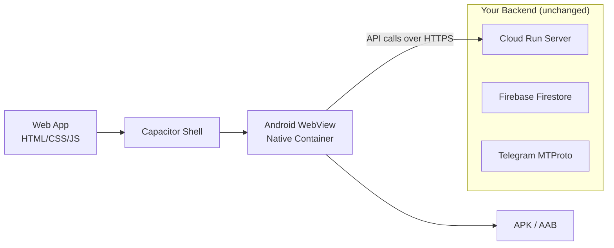

# 🚀 Sonic Vault → Android App via Capacitor

## Architecture Overview



Your app is a **server-rendered PWA** — the frontend (`public/`) is served by an Express backend on Cloud Run, and audio streams come from `/api/stream/:id`. Capacitor wraps the frontend in a native Android WebView, but the backend stays remote. This is the simplest path.

---

## Phase 0: Prerequisites (Manual — YOU do this)

> [!IMPORTANT]
> These tools cannot be installed by me. You need to set them up on your machine first.

| Tool | Why | Install |
|------|-----|---------|
| **Java JDK 17+** | Android build system requires it | [Download Adoptium JDK](https://adoptium.net/) or `winget install EclipseAdoptium.Temurin.17.JDK` |
| **Android Studio** | Provides SDK, emulator, and build tools | [Download Android Studio](https://developer.android.com/studio) |
| **Android SDK** | Actual build toolchain (installed via Android Studio) | Open Android Studio → SDK Manager → Install **API 34** (Android 14) + **Build Tools 34.x** |
| **Gradle** | Build automation (bundled with Android Studio) | Comes with Android Studio |

### Environment Variables (Manual)

After installing, add these to your system PATH / environment:

```powershell
# Add to your system environment variables
ANDROID_HOME = C:\Users\shani\AppData\Local\Android\Sdk
JAVA_HOME    = C:\Program Files\Eclipse Adoptium\jdk-17.x.x-hotspot

# Add to PATH:
# %ANDROID_HOME%\platform-tools
# %ANDROID_HOME%\tools
# %ANDROID_HOME%\tools\bin
```

> [!TIP]
> To verify: Run `java -version` and `adb --version` in PowerShell. Both should return version info.

---

## Phase 1: Capacitor Project Setup (I can automate most of this)

### Step 1.1 — Install Capacitor dependencies

```bash
# From d:\music (project root)
npm install @capacitor/core @capacitor/cli @capacitor/android
```

### Step 1.2 — Initialize Capacitor

```bash
npx cap init "Sonic Vault" "com.sonicvault.app" --web-dir backend/public
```

This creates a `capacitor.config.ts` (or `.json`) at `d:\music\`.

### Step 1.3 — Configure Capacitor for Remote Server

Since your frontend talks to a **remote backend** (Cloud Run), the app should load from your deployed URL, NOT from local files. This is the key configuration:

```json
// capacitor.config.json (generated at d:\music\)
{
  "appId": "com.sonicvault.app",
  "appName": "Sonic Vault",
  "webDir": "backend/public",
  "server": {
    "url": "https://YOUR-CLOUD-RUN-URL.run.app",
    "cleartext": false
  }
}
```

> [!WARNING]
> **Decision Point**: You have two approaches:
> 
> **Option A — Remote URL mode** (recommended for your architecture):
> - `server.url` points to your Cloud Run deployment
> - App always loads latest version from the server
> - Requires internet connection to work
> - Audio streaming works exactly as-is
> 
> **Option B — Local asset mode** (offline-capable, more work):
> - `webDir` bundles static files into the APK
> - Need to hardcode the API base URL in `app.js` (`const API = 'https://your-cloud-run.run.app'`)
> - Works offline for cached content
> - Larger APK size
> 
> **I recommend Option A** since your app already streams from Telegram via the server.

### Step 1.4 — Add Android Platform

```bash
npx cap add android
```

This creates `d:\music\android\` — a full Android Studio project.

---

## Phase 2: Code Changes Needed (I can do all of this)

### 2.1 — Fix API Base URL in `app.js`

Currently:
```javascript
const API = '';  // Empty = relative URLs (works when served from Express)
```

For **Option A** (remote URL): No change needed. Capacitor loads from Cloud Run, so relative URLs work.

For **Option B** (local assets): Must change to:
```javascript
const API = 'https://YOUR-CLOUD-RUN-URL.run.app';
```

### 2.2 — Handle Android Status Bar & Safe Areas

Add to `styles.css`:
```css
/* Android safe area padding for Capacitor */
body {
  padding-top: env(safe-area-inset-top);
  padding-bottom: env(safe-area-inset-bottom);
}
```

### 2.3 — Remove/Adjust PWA Service Worker Registration

In the native Android shell, the Service Worker may conflict with Capacitor's WebView. We should conditionally register it:

```javascript
// Only register SW in browser mode, not in Capacitor
if ('serviceWorker' in navigator && !window.Capacitor) {
  navigator.serviceWorker.register('/sw.js')
    .then(() => console.log('✅ PWA Service Worker registered'))
    .catch(err => console.log('SW registration failed:', err));
}
```

### 2.4 — Handle Back Button (Android Hardware)

Add to `app.js`:
```javascript
// Handle Android hardware back button via Capacitor
if (window.Capacitor) {
  import('@capacitor/app').then(({ App }) => {
    App.addListener('backButton', ({ canGoBack }) => {
      const playerScreen = document.getElementById('screen-player');
      if (playerScreen && playerScreen.classList.contains('active')) {
        navigateTo(lastScreen || 'home');
      } else if (canGoBack) {
        window.history.back();
      } else {
        App.exitApp();
      }
    });
  });
}
```

### 2.5 — Add `@capacitor/app` Plugin

```bash
npm install @capacitor/app
```

---

## Phase 3: Android Project Configuration (Mix of auto & manual)

### 3.1 — App Icon (Manual in Android Studio)

You already have `icon-192.png` and `icon-512.png`. To set them as the Android launcher icon:

1. Open `d:\music\android\` in Android Studio
2. Right-click `app/src/main/res/` → **New → Image Asset**
3. Select your `icon-512.png` as the source
4. Configure foreground/background layers
5. Click **Finish** — it generates all density icons (`mdpi`, `hdpi`, `xhdpi`, etc.)

> [!NOTE]
> Alternatively, I can script this using `@capacitor/assets` plugin, but Android Studio's Image Asset wizard gives better control over adaptive icons.

### 3.2 — Splash Screen (Optional but recommended)

```bash
npm install @capacitor/splash-screen
```

Configure in `capacitor.config.json`:
```json
{
  "plugins": {
    "SplashScreen": {
      "backgroundColor": "#121414",
      "launchShowDuration": 2000,
      "androidScaleType": "CENTER_CROP"
    }
  }
}
```

### 3.3 — Status Bar Styling

```bash
npm install @capacitor/status-bar
```

Add to `app.js`:
```javascript
if (window.Capacitor) {
  import('@capacitor/status-bar').then(({ StatusBar, Style }) => {
    StatusBar.setBackgroundColor({ color: '#121414' });
    StatusBar.setStyle({ style: Style.Dark });
  });
}
```

### 3.4 — Internet Permission (Auto — already default)

The `android/app/src/main/AndroidManifest.xml` already includes `INTERNET` permission by default in Capacitor projects. No action needed.

### 3.5 — Allow Cleartext Traffic (if testing with HTTP)

If your Cloud Run URL uses HTTPS (it does), no change needed. If testing against `localhost`, add to `AndroidManifest.xml`:
```xml
<application android:usesCleartextTraffic="true" ...>
```

---

## Phase 4: Build & Test

### 4.1 — Sync Web Assets to Android

Every time you change web code:
```bash
npx cap sync android
```

### 4.2 — Open in Android Studio (Manual)

```bash
npx cap open android
```

This opens the `d:\music\android\` project in Android Studio.

### 4.3 — Run on Emulator or Device

**Option A — Android Studio UI (Manual):**
1. Click the green ▶ Run button
2. Select an emulator or connected device
3. App builds and launches

**Option B — Command Line:**
```bash
npx cap run android
```

### 4.4 — Build APK for Distribution

In Android Studio:
1. **Build → Build Bundle(s) / APK(s) → Build APK(s)**
2. APK will be at: `android/app/build/outputs/apk/debug/app-debug.apk`

For **release APK** (needs signing — see Phase 5).

---

## Phase 5: Release / Signing (100% Manual)

> [!CAUTION]
> Signing keys are security-critical. **Never share or lose your keystore file**. If you lose it, you can never update the app on Play Store.

### 5.1 — Generate a Signing Key

```bash
keytool -genkey -v -keystore sonic-vault-release.keystore -alias sonicvault -keyalg RSA -keysize 2048 -validity 10000
```

### 5.2 — Configure Signing in Gradle

Edit `android/app/build.gradle`:
```groovy
android {
    signingConfigs {
        release {
            storeFile file('sonic-vault-release.keystore')
            storePassword 'YOUR_STORE_PASSWORD'
            keyAlias 'sonicvault'
            keyPassword 'YOUR_KEY_PASSWORD'
        }
    }
    buildTypes {
        release {
            signingConfig signingConfigs.release
            minifyEnabled true
            proguardFiles getDefaultProguardFile('proguard-android-optimize.txt')
        }
    }
}
```

### 5.3 — Build Release AAB (for Play Store)

```bash
cd android
./gradlew bundleRelease
```

Output: `android/app/build/outputs/bundle/release/app-release.aab`

### 5.4 — Build Release APK (for sideloading)

```bash
cd android
./gradlew assembleRelease
```

Output: `android/app/build/outputs/apk/release/app-release.apk`

---

## Summary: What's Manual vs. Automated

| Step | Who | Effort |
|------|-----|--------|
| Install JDK 17 | 🧑 You | 5 min |
| Install Android Studio + SDK | 🧑 You | 15 min |
| Set ANDROID_HOME / JAVA_HOME | 🧑 You | 2 min |
| Install npm dependencies | 🤖 Me | Auto |
| `cap init` + config | 🤖 Me | Auto |
| `cap add android` | 🤖 Me | Auto |
| Code changes (API, back button, status bar) | 🤖 Me | Auto |
| App icon via Image Asset wizard | 🧑 You | 5 min |
| `cap sync android` | 🤖 Me | Auto |
| Open in Android Studio | 🧑 You | 1 min |
| Run on emulator/device | 🧑 You | 2 min |
| Build debug APK | 🧑 You (in Android Studio) | 2 min |
| Generate signing key | 🧑 You | 3 min |
| Build release APK/AAB | 🧑 You | 5 min |

---

## Known Challenges & Considerations

> [!WARNING]
> ### Audio Background Playback
> Android WebView may pause audio when the app goes to background. Solutions:
> - Use `@nicepurse/capacitor-background-mode` or similar plugin
> - Or use Capacitor's native audio plugins for true background playback
> - Your current `MediaSession` API usage helps but isn't guaranteed in WebView

> [!NOTE]
> ### CORS / Mixed Content
> Your Cloud Run backend already has `cors()` middleware. Capacitor apps run from `capacitor://localhost` (Android) or `http://localhost` — make sure your CORS config allows these origins.

> [!NOTE]
> ### File Size
> The APK will be lightweight (~5-8 MB) since it's essentially just a WebView shell pointing to your Cloud Run URL. No audio files are bundled.

---

## Next Steps

Once you confirm:
1. **Which approach** — Option A (remote URL) or Option B (local assets)?
2. **What's your Cloud Run URL?** (for the server config)
3. **Do you have JDK and Android Studio installed?**

I'll start executing Phase 1 and Phase 2 immediately — installing Capacitor, configuring it, and making the necessary code changes.
