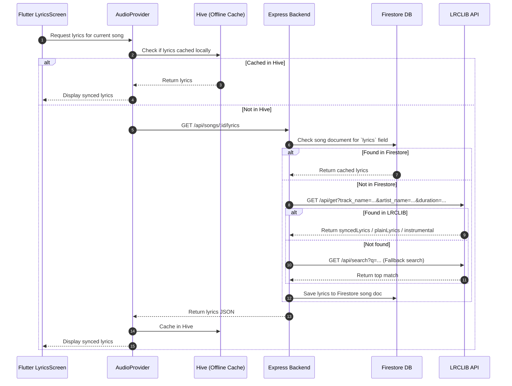

# Synced Lyrics Technical Design

## Architecture Overview



## Data Models

### Firestore & Backend Response Schema
```json
{
  "synced": "[00:14.20] First line\n[00:18.50] Second line\n[00:22.10] Third line",
  "plain": "First line\nSecond line\nThird line",
  "isInstrumental": false,
  "source": "lrclib",
  "updated_at": "ISO_TIMESTAMP"
}
```

### Flutter Model (`lib/core/models/lyrics.dart`)
```dart
class LyricLine {
  final Duration timestamp;
  final String text;

  LyricLine({required this.timestamp, required this.text});
}

class LyricsData {
  final List<LyricLine> lines;
  final String? plainLyrics;
  final bool isInstrumental;
  final bool hasSynced;

  LyricsData({
    required this.lines,
    this.plainLyrics,
    this.isInstrumental = false,
    this.hasSynced = false,
  });

  factory LyricsData.fromLrc(String? lrc, String? plain, bool instrumental) {
    if (instrumental) {
      return LyricsData(lines: [], isInstrumental: true);
    }
    if (lrc == null || lrc.trim().isEmpty) {
      return LyricsData(
        lines: [],
        plainLyrics: plain,
        hasSynced: false,
      );
    }

    final parsedLines = <LyricLine>[];
    final regex = RegExp(r'\[(\d{2}):(\d{2})\.(\d{2,3})\](.*)');

    for (final line in lrc.split('\n')) {
      final match = regex.firstMatch(line.trim());
      if (match != null) {
        final minutes = int.parse(match.group(1)!);
        final seconds = int.parse(match.group(2)!);
        final rawFraction = match.group(3)!;
        final millis = rawFraction.length == 2
            ? int.parse(rawFraction) * 10
            : int.parse(rawFraction);
        final text = match.group(4)!.trim();
        if (text.isNotEmpty) {
          parsedLines.add(LyricLine(
            timestamp: Duration(minutes: minutes, seconds: seconds, milliseconds: millis),
            text: text,
          ));
        }
      }
    }

    parsedLines.sort((a, b) => a.timestamp.compareTo(b.timestamp));

    return LyricsData(
      lines: parsedLines,
      plainLyrics: plain,
      hasSynced: parsedLines.isNotEmpty,
      isInstrumental: false,
    );
  }
}
```

## Active Line Calculation & Auto-Scrolling Algorithm

1. `AudioProvider` subscribes to `positionStream` from `just_audio`.
2. Given position `pos`, the current active line index `i` is the latest line where `line[i].timestamp <= pos`.
3. Auto-scroll: When the active index changes, animate the `ScrollController` / `ScrollablePositionedList` to keep index `i` vertically centered in the viewport with a curve of `Curves.easeInOutCubic` and duration `350ms`.
4. User scrolling override: If the user manually scrolls up/down to browse lyrics, pause auto-scrolling for 3 seconds before smoothly snapping back to the singing position.

## Interactive Tap-to-Seek
When the user taps on any lyric line widget:
`audioProvider.seek(line.timestamp)` is triggered immediately.

## Offline Storage
- When `OfflineService.downloadSong(songId, metadata)` is invoked:
  - If lyrics are not already in `metadata['lyrics']`, query `LyricsService.getLyrics(songId)`.
  - Save the lyrics JSON string in the Hive box `offline_songs` alongside the song metadata.
  - When playing in offline mode, `AudioProvider` pulls lyrics directly from Hive without making any network calls.
